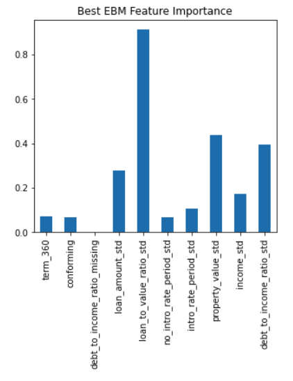
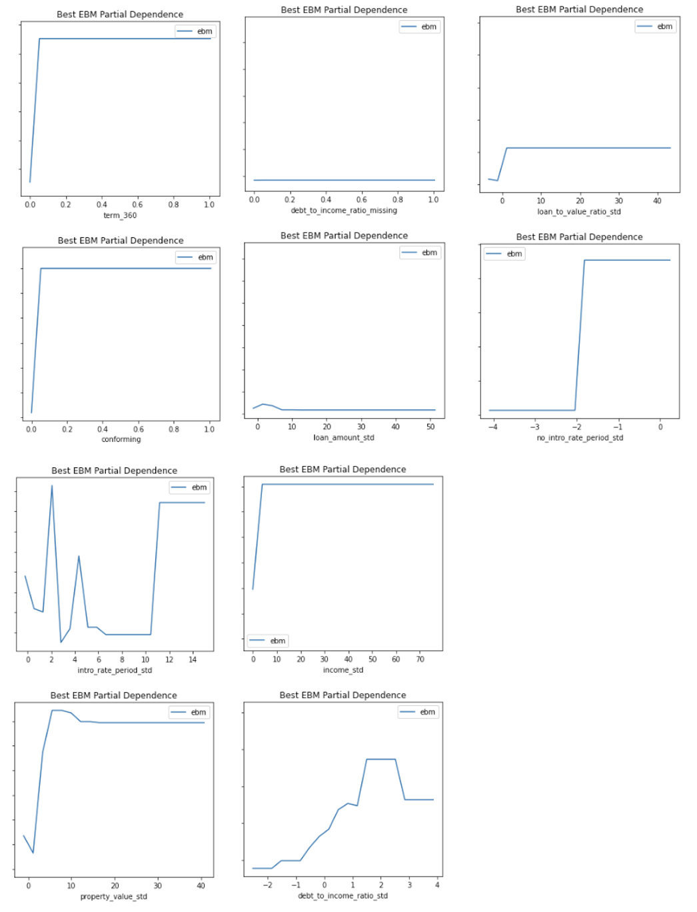
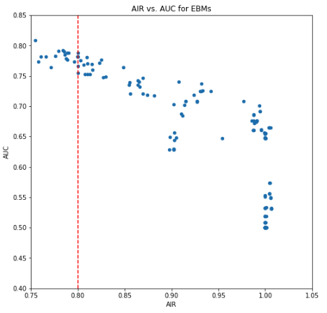
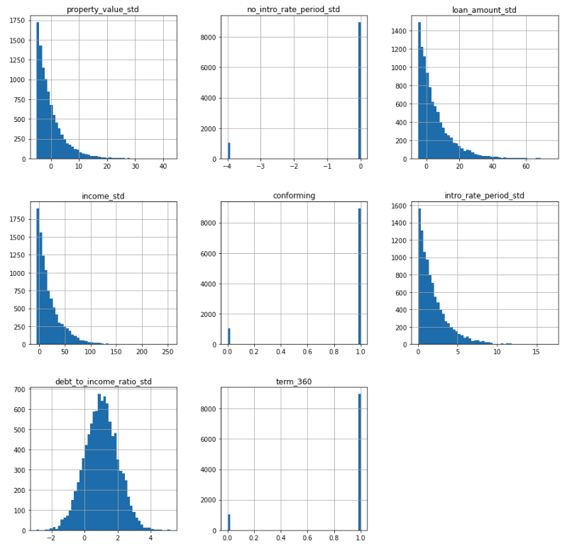
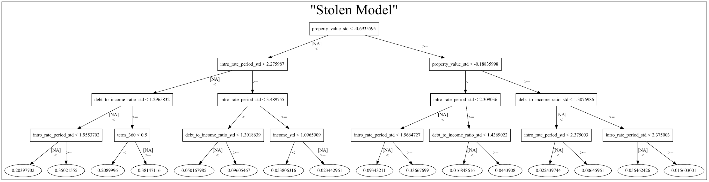
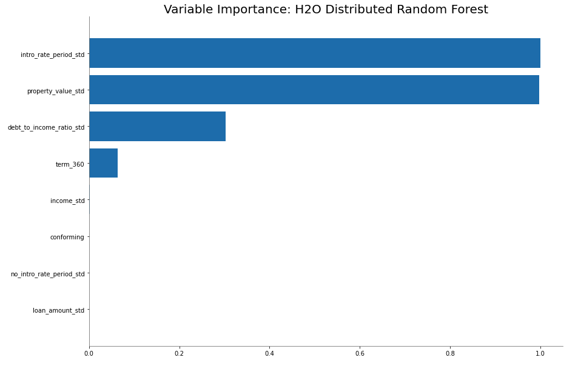
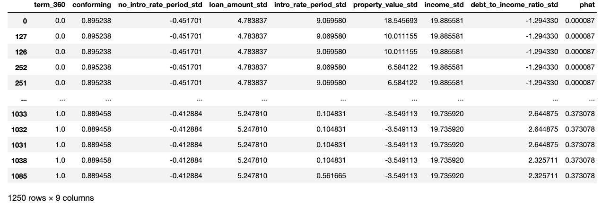
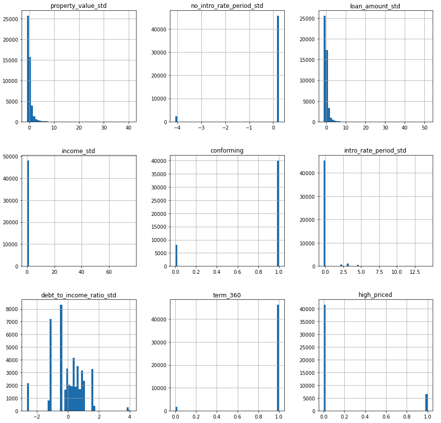
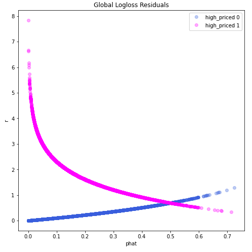

# ML6290_Group2 Home Mortgage Disclosure Act

### - Authors 

Xuan Zhao (xuanzhao@gwu.edu)

Suyash Shrivastava ([suyash65@gwu.edu](mailto:suyash65@gwu.edu))

Jiujiu Yang ([hello99yang@gwu.edu](mailto:hello99yang@gwu.edu))

#### - Workflow

Among Generalized Linear Model (GLM), Monotonic Gradient Boosting (MXGB), and Explainable Boosting Machine (EBM) models, the highest area under curve (AUC) belonged to for EBM model with a value of 0.8249. Therefore, we chosed EBM model as the best model. Bias testing was done by spliting the different groups like "black", "asian", "white", "male", and "female" and calculating the adverse impact ratio (AIR) and area under the curve (AUC). Model extraction attack was done via red-teaming. Lastly, sensitivity analysis (stress testing), residual analysis, and remediation (removing outliers and down-sampling to increase signal from high-priced loans) were done to ensure model debugging.

#### - Intended use

* **Primary intended uses**
  * Intended to be used for banks/ financial institutions to decide whether to lend money to mortgage applicants based on their personal background such as their income, race, gender, etc.

* **Primary intended users**
  * Particularly intended for those mortgage applicants who are planning to invest in real estate.

* **Out-of-scope use cases**
  * The model can only be used to those who ask to a financial assistance in state-owned enterprise public companies rather than provided to all kinds of institutions because of the model limitations and small institutions' data collection capabilities.

#### \- Training data 

* Home Mortgage Disclosure Act (HMDA) labeled training data.
  * **Source:**  https://github.com/jphall663/GWU_rml/tree/master/assignments/data 

* **Data spliting:** Training data (70%), validation data (30%).

* **Training data:** Rows = 112253, Columns = 23.

* **Validation data:** Rows = 48085, Columns = 23.

* **Definition of all the columns in training data :**
  
  | Row_id                       | Data Type | Variable Role | Index                                                        |
  | ---------------------------- | --------- | ------------- | ------------------------------------------------------------ |
  | black                        | Binary    | Input         | Applicants who are black                                     |
  | asian                        | Binary    | Input         | Applicants who are asian                                     |
  | white                        | Binary    | Input         | Applicants who are white                                     |
  | amind                        | Binary    | Input         | Applicants with **???**                                      |
  | hipac                        | Binary    | Input         | **???**                                                      |
  | hispanic                     | Binary    | Input         | Applicants who are hispanic                                  |
  | non_hispanic                 | Binary    | Input         | Applicants who are not hispanic                              |
  | male                         | Binary    | Input         | Gender of the applicant is male                              |
  | female                       | Binary    | Input         | Gender of the applicant is female                            |
  | agegte62                     | Binary    | Input         | Applicants' age is greater than 62                           |
  | agelt62                      | Binary    | Input         | Applicants' age is lower than 62                             |
  | term 360                     | Binary    | Input         | Whether the mortgage is a standard 360 month mortgage (1) or a different type of mortgage (0). |
  | conforming                   | Binary    | Input         | Whether the mortgage conforms to normal standards (1), or whether the loan is different (0), e.g., jumbo, HELOC, reverse mortgage, etc. |
  | debt_to_income_ratio_missing | Binary    | Input         | Missing marker (1) for std. debt to income ratio.            |
  | loan_amount_std              | Numeric   | Input         | Standardized amount of the mortgage for applicants.          |
  | loan_to_value_ratio_std      | Numeric   | Input         | Ratio of the size of the mortgage to the value of the applicant's property. |
  | no_intro_rate_period_std     | Binary    | Input         | Whether or not a mortgage includes an introductory rate period. |
  | intro_rate_period_std        | Numeric   | Input         | Standardized introductory rate period for mortgage applicants. |
  | property_value_std           | Numeric   | Input         | Value of the mortgaged property.                             |
  | income_std                   | Numeric   | Input         | Standardized income of the applicants.                       |
  | debt_to_income_ratio_std     | Numeric   | Input         | Standardized debt-to-income ratio of the applicants.         |
  | high_priced                  | Binary    | Target        | Whether (1) or not (0) the annual percentage rate (APR) charged for a mortgage is 150 basis points (1.5%) or more above a survey-based estimate of similar mortgages. |
  
  
  
 * **Definition of all engineered columns:**

   | Row_id                       | Data Type | Variable Role | Index                                                        |
   | ---------------------------- | --------- | ------------- | ------------------------------------------------------------ |
   | term 360                     | Binary    | Input         | Whether the mortgage is a standard 360 month mortgage (1) or a different type of mortgage (0). |
   | conforming                   | Binary    | Input         | Whether the mortgage conforms to normal standards (1), or whether the loan is different (0), e.g., jumbo, HELOC, reverse mortgage, etc. |
   | debt_to_income_ratio_missing | Binary    | Input         | Missing marker (1) for debt to income ratio std.             |
   | loan_amount_std              | Numeric   | Input         | Standardized amount of the mortgage for applicants.          |
   | loan_to_value_ratio_std      | Numeric   | Input         | Ratio of the mortgage size to the value of the property for mortgage applicants. |
   | no_intro_rate_period_std     | Binary    | Input         | Whether or not a mortgage does not include an introductory rate period. |
   | intro_rate_period_std        | Numeric   | Input         | Standardized introductory rate period for mortgage applicants. |
   | property_value_std           | Numeric   | Input         | Value of the mortgaged property.                             |
   | income_std                   | Numeric   | Input         | Standardized income for mortgage applicants.                 |
   | debt_to_income_ratio_std     | Numeric   | Input         | Standardized debt-to-income ratio for mortgage applicants.   |
   | high_priced                  | Binary    | Target        | Whether (1) or not (0) the annual percentage rate (APR) charged for a mortgage is 150 basis points (1.5%) or more above a survey-based estimate of similar mortgages. |

   

#### \- Evaluation data

* Home Mortgage Disclosure Act (HMDA) unlabeled test data.
  * **Source:** https://github.com/jphall663/GWU_rml/tree/master/assignments/data
* **Test data:** rows = 19831, columns = 22.
* **Difference:** Training data has an extra target variable column called "high_priced" that the test data does not have.

#### - Model details (in the best remediated model)

* **Inputs:** 

  | Inputs                   |
  | ------------------------ |
  | income_std               |
  | conforming               |
  | term_360                 |
  | loan_amount_std          |
  | intro_rate_period_std    |
  | property_value_std       |
  | no_intro_rate_period_std |
  | debt_to_income_ratio_std |

* **Target:** high_priced

* **The type of the best model:** Explainable Boosting Machine (EBM)

* **Software and the version:** python (3.9.7), interpret (0.2.7)

* **Hyperparameters:** 

  | Best Model Hyperparameters | Value |
  | -------------------------- | ----- |
  | max_bins                   | 256   |
  | max_interaction_bins       | 32    |
  | interactions               | 5     |
  | outer_bags                 | 4     |
  | inner_bags                 | 4     |
  | learning_rate              | 0.001 |
  | validation_size            | 0.5   |
  | min_samples_leaf           | 5     |
  | max_leaves                 | 3     |

#### - Quantitative analysis 

* **Model selection:** Our criteria is AUC and the higher AUC means the better model. Based on the following value, we choose EBM model as the best model.

  | Model | AUC    |
  | ----- | ------ |
  | GLM   | 0.7538 |
  | MXGB  | 0.7921 |
  | EBM   | 0.8249 |

* **Feature importance：**The best EBM feature importance plot shows global importance in EBM to make a feature selection. 

* **Partial dependence:** Every feature in each plot in the following are partially effect predicted variable high_priced in EBM.

* **Remediation of Discovered Discrimination:** 

  * **Grid search results as plot:** According to grid search results, the remediated EBM retrained with the best AUC is 0.7878 above 0.8 AIR (0.8002), and we can get the hyperparameters.
  
    
  
  * **Adverse impact ratio:**
  
    | Compare v. Control            | AIR   |
    | ----------------------------- | ----- |
    | Asian people vs. White people | 1.142 |
    | Black people vs. White people | 0.800 |
    | Females vs. Males             | 0.959 |
  

* **Model extraction attack:**

  * **Visualize simulated data:**

    

    

  * **Stolen model:**

    

    

  * **Variable importance for stolen model:**

    

    

  * Adversarial examples that can reliably evoke extremely low and high enough predictions from the blackbox API (0.38 is likely above the cutoff for most credit models). These can most easily be used to falsify a loan application to recieve a low-priced loan (using low adversaries). Or they could be used to ensure someone else recievces a high-priced loan.

  

* **Remediation**

  * **Sensitivity analysis (Stress Testing)**:  Simulate recession conditions in validation data.
  
    
  
  * **Residual Analysis:** Residuals Plot for removing outliers.
  
    
  
  * **Remediated EBM true AUC on validation data:**
  
  | Partition  | AUC    |
  | ---------- | ------ |
  | Validation | 0.7949 |

#### - Ethical considerations

* Different criterias chosen for building the same models may cause varied results. The biased results will cause harm to people in the real world. The data used should be kept secure and extremely confidential since any illegitimate use will cause severe privacy concerns. The model will most likely start going in the wrong direction if it is not constantly maintained and managed. Everyone working on this kind of sensitive data should not poison the data for their personal ulterior motives which might be detrimental to others.

#### - Caveats and Recommendations

* The training data is unbalanced, which may cause some unbalanced results in different groups during evaluation.

