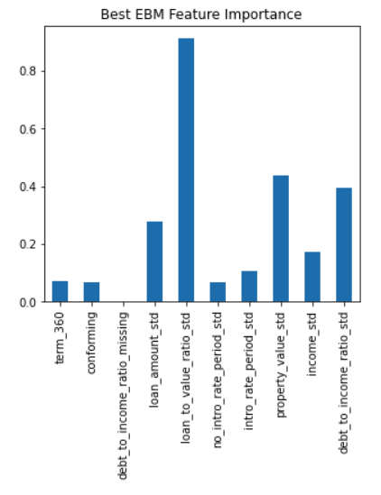
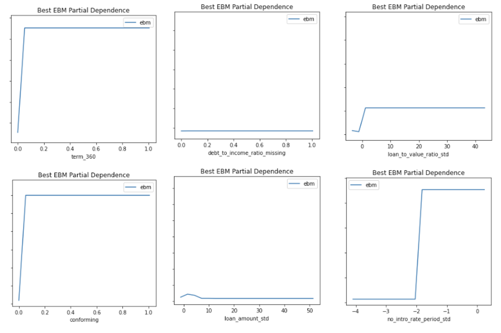
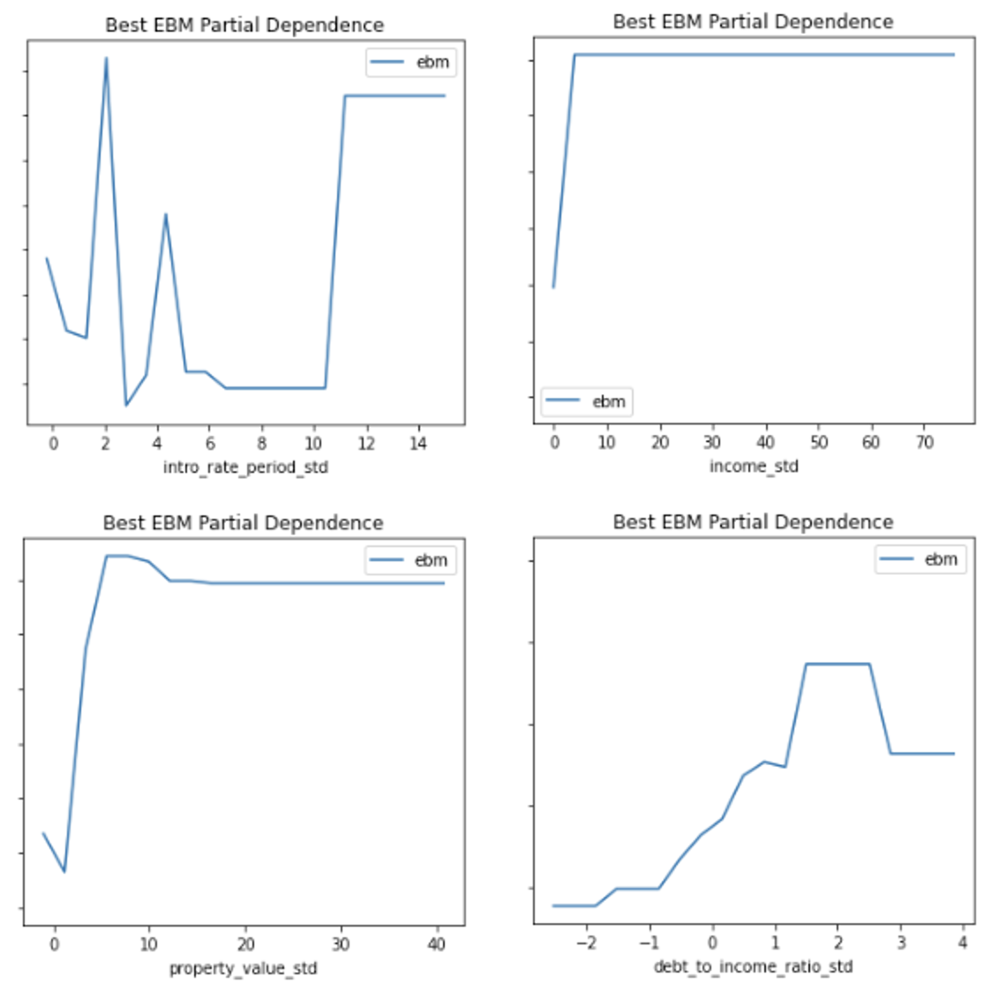
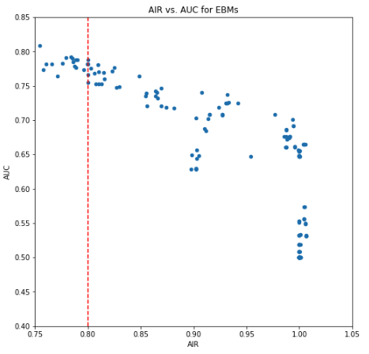
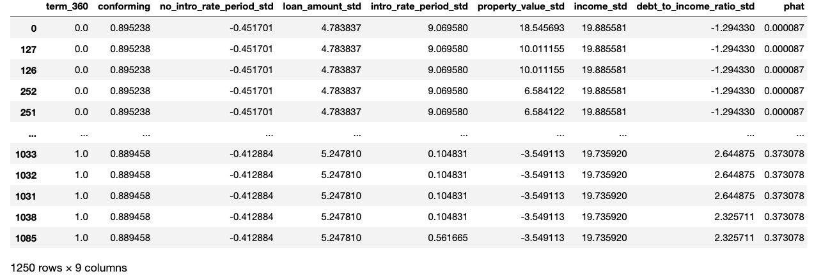

# ML6290_Group2 Home Mortgage Disclosure Act

### - Group information 

Xuan Zhao (xuanzhao@gwu.edu)

Suyash Shrivastava ([suyash65@gwu.edu](mailto:suyash65@gwu.edu))

Jiujiu Yang ([hello99yang@gwu.edu](mailto:hello99yang@gwu.edu))

### comparison of the three models, selecting a best model, and then working on the best model with bias testing, red-teaming, and model debugging. (DELETE BEFORE FINAL SUBMIT)

Among Generalized linear models (GLM), Monotonic extreme gradient boosting (MXGB), and explainable boosting machine (EBM) models, the highest area under curve (AUC) 0.8249 belongs to ebm model. Therefore, ebm model is the best model**(MXGB‘s full name??? Revise: Extend the models' name!!!)**. Spliting the different groups within "black", "asian", "white", "male", and "female" to do the bias testing by using the adverse impact ratio (AIR) and AUC. Model extraction attack is for red-teaming.  Last, sensitivity analysis (stress testing), residual analysis, and remediation (remove outliers and down-sample to increase signal from high-priced loans) are in order to make model debugging.

#### - Intended use

##### * Primary intended uses (1st & 2nd points: business values) (5#) 

* Intended to be used for bank systems to make a decision whether they lend to the mortgage applicants based on those lenders’ personal backgrounds, such as their standardized income, race, gender, etc.

##### * Primary intended users (3rd points)

* Particularly intended for those mortgage applicants who are planning to invest in real estate.

##### * Out-of-scope use cases (4th point, consider)

#### \- Training data 

* Home Mortgage Disclosure Act (HMDA) labeled training data.
  * https://github.com/jphall663/GWU_rml/tree/master/assignments/data

* The data is split into training data as 70%, and validation data as 30%.

* Train data rows = 112253, columns = 23.

​		Validation data rows = 48085, columns = 23.

* the meaning of all training data columns:
  * **row_id:** index
  * **black:** Applicants with black skin
  * **asian:**  Applicants with yellow skin
  * **white:** Applicants with white skin
  * **amind:** Applicants with **???**
  * **hipac:** **???**
  * **hispanic:** **???**
  * **non_hispanic:** **???**
  * **male:** gender in male
  * **female:** gender in female
  * **agegte62:** Applicants' age are greater than 62
  * **agelt62:** Applicants' age are lower than 62
  * **term 360:** Binary numeric input, whether the mortgage is a standard 360 month mortgage (1) or a different type of mortgage (0).
  * **conforming:** Binary numeric input, whether the mortgage conforms to normal standards (1), or whether the loan is different (0), e.g., jumbo, HELOC, reverse mortgage, etc.
  * **debt_to_income_ratio_missing:** Binary numeric input, missing marker (1) for debt to income ratio std.
  * **loan_amount_std:** Numeric input, standardized amount of the mortgage for applicants.
  * **loan_to_value_ratio_std:** Numeric input, ratio of the mortgage size to the value of the property for mortgage applicants.
  * **no_intro_rate_period_std:** Binary numeric input, whether or not a mortgage does not include an introductory rate period.
  * **intro_rate_period_std:** Numeric input, standardized introductory rate period for mortgage applicants.
  * **property_value_std:** Numeric input, value of the mortgaged property.
  * **income_std:** Numeric input, standardized income for mortgage applicants.
  * **debt_to_income_ratio_std:** Numeric input, standardized debt-to-income ratio for mortgage applicants.
  * **high_priced:** Binary target, whether (1) or not (0) the annual percentage rate (APR) charged for a mortgage is 150 basis points (1.5%) or more above a survey-based estimate of similar mortgages. (High-priced mortgages are legal, but somewhat punitive to borrowers. High-priced mortgages often fall on the shoulders of minority home owners, and are one of many issues that perpetuates a massive disparity in overall wealth between different demographic groups in the US.)

 * Define the meaning of all engineered columns
   * **term 360:** Binary numeric input, whether the mortgage is a standard 360 month mortgage (1) or a different type of mortgage (0).
   * **conforming:** Binary numeric input, whether the mortgage conforms to normal standards (1), or whether the loan is different (0), e.g., jumbo, HELOC, reverse mortgage, etc.
   * **debt_to_income_ratio_missing:** Binary numeric input, missing marker (1) for debt to income ratio std.
   * **loan_amount_std:** Numeric input, standardized amount of the mortgage for applicants.
   * **loan_to_value_ratio_std:** Numeric input, ratio of the mortgage size to the value of the property for mortgage applicants.
   * **no_intro_rate_period_std:** Binary numeric input, whether or not a mortgage does not include an introductory rate period.
   * **intro_rate_period_std:** Numeric input, standardized introductory rate period for mortgage applicants.
   * **property_value_std:** Numeric input, value of the mortgaged property.
   * **income_std:** Numeric input, standardized income for mortgage applicants.
   * **debt_to_income_ratio_std:** Numeric input, standardized debt-to-income ratio for mortgage applicants.
   * **high_priced:** Binary target, whether (1) or not (0) the annual percentage rate (APR) charged for a mortgage is 150 basis points (1.5%) or more above a survey-based estimate of similar mortgages. (High-priced mortgages are legal, but somewhat punitive to borrowers. High-priced mortgages often fall on the shoulders of minority home owners, and are one of many issues that perpetuates a massive disparity in overall wealth between different demographic groups in the US.)

#### \- Evaluation data

* Home Mortgage Disclosure Act (HMDA) unlabeled test data.
  * https://github.com/jphall663/GWU_rml/tree/master/assignments/data
* Test data rows = 19831, columns = 22.
* Difference: Training data has a target variable "high_priced" than test data does.

#### - Model details (ing)

* **Inputs:** property_value_std, no_intro_rate_period_std, loan_amount_std, income_std, conforming, intro_rate_period_std, debt_to_income_ratio_std, term_360
* **Target:** high_priced
* **Best model:** explainable boosting machine (EBM)
* **Software:** interpret
* **Software version:** interpret (0.2.7)
* **Hyperparameters:** the best cutoff is 0.17 **???** 

#### - Quantitative analysis 

* Model selection:

  | Model | AUC    |
  | ----- | ------ |
  | GLM   | 0.7538 |
  | MXGB  | 0.7921 |
  | EBM   | 0.8249 |

* Feature importance

* Discrimination

  | Compare v. Control            | AIR   |
  | ----------------------------- | ----- |
  | Asian people vs. White people | 1.196 |
  | Black people vs. White people | 0.740 |
  | Females vs. Males             | 0.948 |

* According to grid search results, the remediated EBM retrained with AUC is 0.7878 above 0.8 AIR (0.8002).

  

* Adversarial examples that can reliably evoke extremely low and high enough predictions from the blackbox API (0.38 is likely above the cutoff for most credit models.). These can most easily be used to falsify a loan application to recieve a low-priced loan (using low adversaries). Or they could be used to ensure someone else recievces a high-priced loan.

  

* Remediation (**consider the description here and the following points???**)

  | Partition  | AUC    |
  | ---------- | ------ |
  | Validation | 0.7949 |

#### - Ethical considerations

* Different criteria for models may cause different results. Training data used is Community, Transparency, Inclusivity, Privacy, and Topic-neutrality. Because of privacy considerations, the model does not take into account user history when making judgments about applicants’ background.

#### - Caveats and Recommendations

* The training data are unbalanced, which may cause some unbalanced results in different groups for evaluation.

